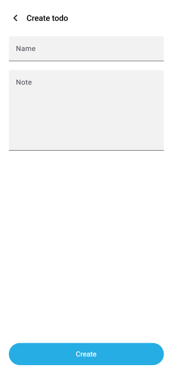
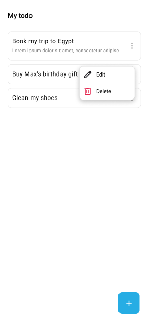

# Flutter challenge guidelines

## Objective

Develop a Flutter mobile application that manages a task list (a TODO list). The application should allow to create, edit, delete, list, and view the tasks. It is essential that the application can operate in offline mode, enabling the user to manage tasks even when the device has no network connection. Data synchronization should occur automatically when the network becomes available again. You must use the API provided in this repository for storing tasks in a persistant way (see [API section](#api) below).

### Technical Specifications

**1. Required Pages**:

The application must have at least 4 pages (refer to the [mockups](#mockups) below):
- List Page: Displays the list of tasks.
- Creation Page: Form to create a new task.
- Details Page: Displays the details of a specific task.
- Edit Dialog: A dialog to modify an existing task.

**2. Recommended Libraries:**

We use the following libraries internally, but you are completely free to make your own choices:
- Isar: For local data management.
- Go_Router: For navigation management within the application.
- Bloc: For reactive state management.
- Chopper / Json_Serializable: For REST API calls and data serialization.

**3. Architecture:**

Implementing an architecture that follows CLEAN principles will be highly appreciated. However, you are free to choose the specific implementation. The objective is to demonstrate your ability to structure the code in a modular and maintainable way.

**4. Bonus Features (not mandatory):**

- Task search (available both offline and online).
- The ability to take a photo and associate it with a task, as well as to add attachments.

### Deliverable

The project should be able to be executed with `flutter run` on an `Android Pixel 7 (API 34)` emulator.

Provide the `dart-defines` in a json format if necessary. The project should run from the command `flutter run --debug --dart-define-from-file=defines.json`

You must indicate the line where we will need to set the IP of the local API server (see "Running the API on your laptop/workstation" below).
Please also send us back the API code if you modify it.

We will evaluate the code quality (soundness and readability) as well as the application architecture.

## API

### Running the API on your laptop/workstation

You will need to have `docker` and GNU `make` installed.
The API is intendend to be very lightweight, sqlite is embedded in the docker container to keep things as simple as possible.

The provided API is not for production use, but only for testing purposes.

Due to the database being embedded in docker, there is no persistence of the database by default. 

You can mount a volume to `/app/todos.db` if you need a way to keep the database persistent between restarts.

The API doesn't serve static files. If you upload files, do so by encoding them as base64, the `file` field is defined as a `TEXT` in the sqlite3 schema.

The API is kept very broad on purpose, you do not have to implement everything the API allows you to. The very basics for this assignment do not need advanced filters, file support, batch creation or task priority.

Simply run `make run` to run the backend.
The server will start listening on port `8080`.

You can stop the server at any time with `Ctrl + C` (`SIGINT` signal).

You need to use this server to store tasks in a persistant way. You can access the server from the Android Studio emulator by **using the IP address of your machine on the local network (e.g. 192.168.0.1)** and NOT `localhost`, see for example [this thread](https://stackoverflow.com/questions/47372568/how-to-point-to-localhost8000-with-the-dart-http-package-in-flutter).

### API endpoints

The API code is located in [./bin/server.dart](./bin/server.dart).

#### Task collection: `/` (GET, POST, DELETE)

To create a new task, use `POST /` with a task object in the body (see "Task object" section below). Of course, you can omit the `id` field in the body, the `id` of the created task will be returned in the response.

When creating / updating a task, the expected body is of the same format as the response, except for the following:
- The `id` field should not be sent. If sent the API will ignore it
- `created_at` is ignored, it is automatically set by the API
- `updated_at` is ignored, it is automatically set by the API
- The `completed_at` field is ignored, instead, to mark a task as completed, send the `completed` field with a boolean (`true` if the task is completed, `false` otherwise)

To list all tasks, use `GET /`. It will return a list of tasks `[{"id": 1, ...}, ...]` as decribed below in "Task object".

Use `DELETE /` to delete all tasks.

If necessary, you can filter tasks by using the following query parameters on `GET /?...`:
- is_completed: true/false => whether a todo is done
- title_contains: string => checks the title
- body_contains: string => checks the body
- has_file: true/false => whether a file is attached
- created_before/created_after: datetime => created before / after a certain date
- updated_before/updated_after: datetime => updated before / after a certain date
- completed_before/completed_after: datetime => completed before / after a certain date
- priority: int => priority equals
- priority_gt / gte / lt / lte: priority greater than, greater than or equals and so on

All filters are are ANDed together.

#### Task object: `/<id>` (GET, PATCH, DELETE)

A successful `GET /1` response returns a **task object**:

```json
{
    "id": 1,
    "title": "Test TODO",
    "body": null,
    "file": null,
    "metadata": null,
    "priority": 1,
    "created_at": "2024-08-19T16:59:15.594295",
    "updated_at": "2024-08-19T16:59:15.594295",
    "completed_at": null // or datetime
}
```

Use `PATCH /<id>` to modify a task. You do not need to specify unmodified fields in the request.

Use `DELETE /<id>` to delete a task.

#### Batch creation: `/batch` (POST)

You can create several tasks at once by instead sending a list of task objects in the body of the request (as JSON of course).

The same caveats apply as for the individual task creation, i.e. `id`, `created_at`, `updated_at`, `completed_at` are ignored, and the `completed` field is used to mark a task as completed.

Batch request is there as an option should you choose to use it.

#### Raw queries: `/query` (POST)

In case the API is not flexible enough for your use case, you can make SQL queries directly by using the `/query` endpoint. Keep in mind that it is there mostly for troubleshooting, or to implement more
advanced filters / conditions. The expected body is as follows:

```json
{
  "query": "SELECT * FROM todos WHERE id=?;",
  "values": ["2"]
}
```

#### Additional features:

The API supports the following additional features:

- If-None-Match / ETag headers on requests/responses
- CORS

## Mockups

Those mockups are an inspiration for the design of the application. You are free to make changes to the design as you see fit.

### List Page

The list page displays the list of tasks. The displayed tasks are ordered by creation date.


### Creation Page

The creation page is a form to create a new task. The task has a title and note.



### Detail Page

The detail page displays the details of a specific task.


### Edit Dialog

The edit dialog is a dialog to modify an existing task.


### Task options

The task options dialog is a dialog to edit or to delete a task.


